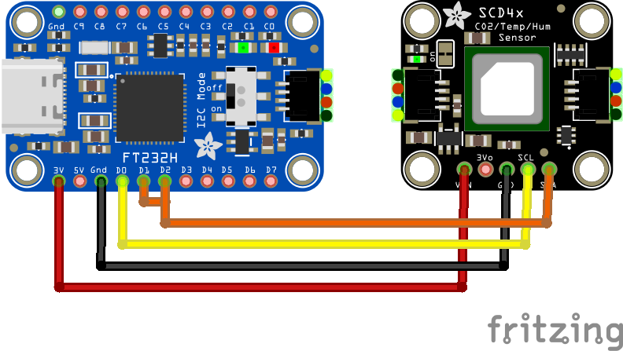

Rust SCD4x Crate
====

A Rust crate to query CO₂ concentration, temperature and humidity from sensor [SCD4x]

<https://gitlab.com/claudiomattera/scd4x-rs/>

[SCD4x]: https://sensirion.com/products/catalog/SCD40/

This crate supports both [`embedded-hal`][embedded-hal] and [`embedded-hal-async`][embedded-hal-async].

[embedded-hal]: https://crates.io/crates/embedded-hal
[embedded-hal-async]: https://crates.io/crates/embedded-hal-async

See the [changelog](./CHANGELOG.md) for this project.

Usage
----

Add the dependency to `Cargo.toml`.

~~~~toml
[dependencies.scd4x-rs]
version = "0.2.0"
~~~~

Optionally enable the desired features.

| Feature              | Description                              |
|----------------------|------------------------------------------|
| `blocking` (default) | Enable the blocking sensor `Scd4x`       |
| `async` (default)    | Enable the async sensor `AsyncScd4x`     |
| `std`                | Implement `std::error::Error` for errors |
| `uom`                | Use `uom` for measurement types          |

A `Scd4x` structure can be created from an I²C interface and a delay function.

~~~~rust
use scd4x_rs::Scd4x;

let i2c = ...
let delay = ...

let sensor = Scd4x::new(i2c, delay);

let mut sensor = sensor.stop_periodic_measurement()?;
sensor.reinit()?;

let serial_number = sensor.get_serial_number()?;
println!("Serial number: 0x{serial_number:x}");

let mut sensor = sensor.start_periodic_measurement()?;

for _ in 0..5 {
    println!("Waiting before next measurement");
    delay.delay_ms(5_000);

    let sample = sensor.read_measurement()?;

    println!("Sample: ┳ CO₂: {} ppm", sample.co2);
    println!("        ┣ Temperature: {} C", sample.temperature);
    println!("        ┗ Humidity: {} %", sample.humidity);

    Ok(sample)
}

let sensor = sensor.stop_periodic_measurement()?;
~~~~

An `AsyncScd4x` structure can be used with asynchronous HALs.
Its API is completely identical to `Scd4x`, just with `.await` at the end of function calls.

~~~~rust
use scd4x_rs::AsyncScd4x;

let i2c = ...
let delay = ...

let sensor = AsyncScd4x::new(i2c, delay);

let mut sensor = sensor.stop_periodic_measurement().await?;
sensor.reinit().await?;

let serial_number = sensor.get_serial_number().await?;
println!("Serial number: 0x{serial_number:x}");

let mut sensor = sensor.start_periodic_measurement().await?;

for _ in 0..5 {
    println!("Waiting before next measurement");
    delay.delay_ms(5_000);

    let sample = sensor.read_measurement().await?;

    println!("Sample: ┳ CO₂: {} ppm", sample.co2);
    println!("        ┣ Temperature: {} C", sample.temperature);
    println!("        ┗ Humidity: {} %", sample.humidity);

    Ok(sample)
}

let sensor = sensor.stop_periodic_measurement().await?;
~~~~

Examples
----

The examples in directory [`examples`](./examples) show how to use this crate with an [Adafruit FT232H] board.

Connect the board to the sensor as shown (yes, D1 and D2 must be shorted for I²C to work).

| Adafruit FT232H | SCD4x |
|-----------------|-------|
| 3v              | VIN   |
| Gnd             | GND   |
| D0              | SCL   |
| D1 and D2       | SDA   |

And run the examples:

~~~~shell
just run-example continuous

just run-example low-power
~~~~

[Adafruit FT232H]: https://www.adafruit.com/product/2264

Sensor State
----

The sensor is implemented using the [type-state pattern], i.e. its state is part of the type `Scd4x<..., State>`.
The sensor can be in two states: idle or measuring.
Functions that can only be executed when the sensor is idling are only implemented on type `Scd4x<..., Idle>`, and functions that can only be executed when the sensor is actively measuring are only implemented on type `Scd4x<..., Measuring>`.

The sensor is normally created in idle state with `Scd4d::new()`.
Calling functions such as `start_periodic_measurement()`, `start_low_power_periodic_measurement()`, `measure_single_shot()` or `measure_single_shot_rht_only()` will consume the variable and return an new one of type `Scd4x<..., Measuring>`.
Function `stop_periodic_measurement()` will again consume the variable and return an new one of type `Scd4x<..., Idle>`.

Alternatively, the sensor can be created directly in measuring state with `Scd4d::new_in_measuring()`.
This is useful, for instance, when the sensor is left measuring while the controller is put to sleep.
When the controller awakes again, it should not call `start_periodic_measurement()` again, but instead it should create the sensor directly in measuring state and start reading samples.

[type-state pattern]: https://cliffle.com/blog/rust-typestate/

Unit of Measurements
----

By default, this crate uses `f32` values for all the measurements CO₂ concentration, temperature and humidity, and the operating quantities altitude and pressure.
When instead enabling the Cargo feature `uom`, it uses quantities from crate [uom].
CO₂ concentration values have type `uom::si::f32::Ratio`, temperature values have type `uom::si::f32::ThermodynamicTemperature`, humidity values have type `uom::si::f32::Ratio`, altitude values have type `uom::si::f32::Length`, and pressure values have type `uom::si::f32::Pressure`.

[uom]: https://crates.io/crates/uom

License
----

Copyright Claudio Mattera 2024

You are free to copy, modify, and distribute this application with attribution under the terms of either

*   Apache License, Version 2.0
    (file [`LICENSE-APACHE-2.0.txt`](./LICENSE-APACHE-2.0.txt) or <https://opensource.org/licenses/Apache-2.0>)
*   MIT license
    (file [`LICENSE-MIT.txt`](./LICENSE-MIT.txt) or <https://opensource.org/licenses/MIT>)

at your option.

This project is entirely original work, and it is not affiliated with nor endorsed in any way by Sensirion.
